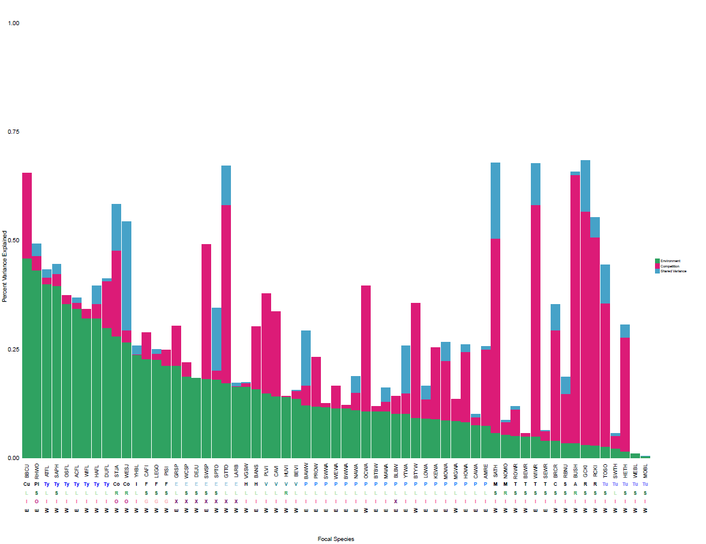
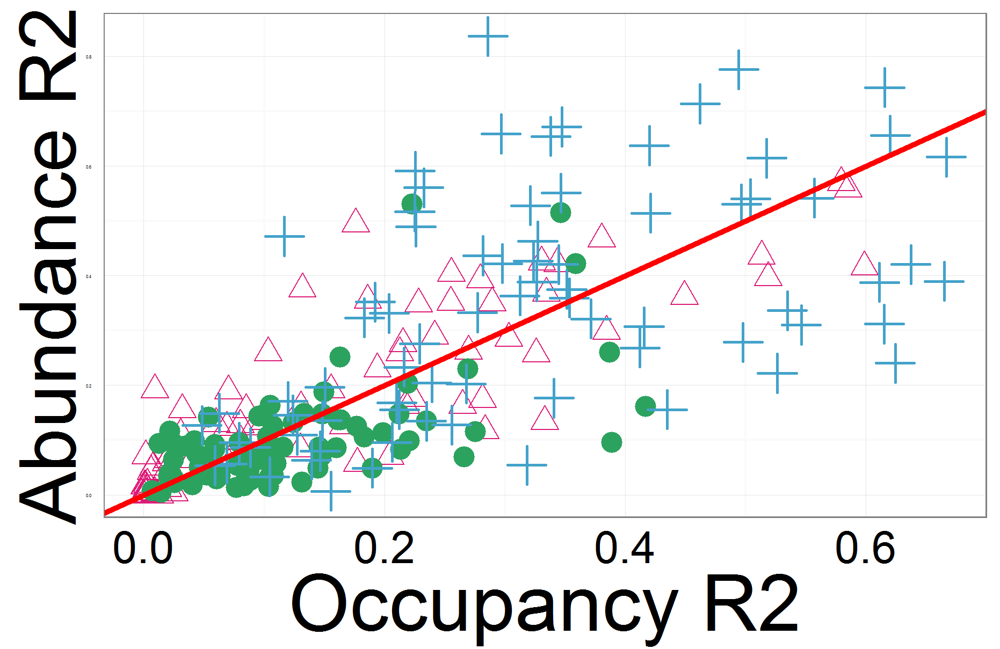

```{r setup, include=FALSE}
knitr::opts_chunk$set(echo = FALSE)
library(lme4)
library(ggplot2)
library(tidyr)
library(dplyr)
library(plyr)
```

## Variance Partitioning

o	  >50% variance explained for 9 species out of 63 - abiotic, biotic, shared

o	  Avg of 30% total, 15% env, and 13% biotic variance explained for each focal spp

o	  Figure 2 = bar plot 

o	  Figure 3 - violin plots? Nec?



## GLM occupancy 

o	  Residuals - seems fairly symmetrical, so data fit relatively well by the model

o	  Table 1 
```{r3codechunk, echo=FALSE}
occumatrix = read.csv('occumatrix.csv', header = TRUE)
# add on success and failure columns by creating # of sites where birds were found
# and # of sites birds were not found from original bbs data
# create counter column to sum across years
subfocalspecies = read.csv(" subfocalspecies.csv", header = TRUE)

# using equation species sum*Focal occ to get success and failure for binomial anlaysis
occumatrix$sp_success = as.factor(occumatrix$numyears * occumatrix$FocalOcc)
occumatrix$sp_fail = as.factor(occumatrix$numyears * (1 - occumatrix$FocalOcc))

# using equation species sum*Focal abun to get success and failure for binomial anlaysis
occumatrix$sp_success_abun = as.factor(occumatrix$numyears * occumatrix$FocalAbundance)
occumatrix$sp_fail_abun = as.factor(occumatrix$numyears * (1 - occumatrix$FocalAbundance))

cs <- function(x) scale(x,scale=TRUE,center=TRUE)
# source: http://permalink.gmane.org/gmane.comp.lang.r.lme4.devel/12080
########################################################################### NLCD
nlcd = read.csv('Z:/GIS/birds/NLCD_buffers/BBS_NLCD_400_m_buffer.csv', header = TRUE)
# summing dediduous forest (41), evergreen forest (42), mixed forest (43), all have >20% total vegetation cover
nlcd$forest = (nlcd$NLCD.41 + nlcd$NLCD.42 + nlcd$NLCD.43)/nlcd$SUM

occumatrix1 = merge(occumatrix, nlcd[, c('RT..NO.', 'forest')], by.x = "stateroute", by.y = "RT..NO.")

#### GLM of all matrices not just subset #### INCLUDES LC
glm_occ_rand_site = glmer(cbind(sp_success, sp_fail) ~ cs(comp_scaled) + 
                            abs(zTemp)+abs(zElev)+abs(zPrecip)+abs(zEVI) + (1|stateroute:Species), family = binomial(link = logit), data = occumatrix)
summary(glm_occ_rand_site) 

pTemp = predict(glm_occ_rand_site, newdata=with(occumatrix,data.frame(zTemp=0,comp_scaled,zPrecip,zElev,zEVI,stateroute,Species, FocalOcc)), allow.new.levels = TRUE) #predict values assuming zTemp=0

inverselogit <- function(p) {exp(p)/(1+exp(p))} 
newintercept <- function(p) {mean(exp(p)/(1+exp(p)))} 

# this relationship should be negative
ggplot(data = occumatrix, aes(x = abs(zTemp), y = FocalOcc)) + 
  stat_function(fun=inverselogit, color = "blue", lwd=2) + 
  geom_point(colour="black", shape=19, alpha = 0.2) + theme_classic()

ggplot(data = occumatrix, aes(x = abs(zEVI), y = FocalOcc)) + 
  stat_function(fun=inverselogit, color = "blue") + 
  geom_point(colour="black", shape=19, alpha = 0.2)+ theme_classic()

ggplot(data = occumatrix, aes(x = abs(zElev), y = FocalOcc)) + 
  stat_function(fun=inverselogit, color = "blue") + 
  geom_point(colour="black", shape=19, alpha = 0.2)+ theme_classic()

ggplot(data = occumatrix, aes(x = abs(zPrecip), y = FocalOcc)) + 
  stat_function(fun=inverselogit, color = "blue") + 
  geom_point(colour="black", shape=19, alpha = 0.2)+ theme_classic()

ggplot(data = occumatrix, aes(x = comp_scaled, y = FocalOcc)) + 
  stat_function(fun=inverselogit, color = "blue") + 
  geom_point(colour="black", shape=19, alpha = 0.2)+ theme_classic()

```

## Traits LM 

o	  Residuals - not symmetrical, so data not fit well by the model

o	  t-statistic values not far away from zero and are small relative to the standard error, probably no relationship exists

o	  adjusted R2 adjusts for the number of variables considered - 0.148 env only highest

o	  Table 2
```{r4m, echo=TRUE}
envflip=read.csv("envflip.csv", header = TRUE)
env_lm = subset(envflip, Type == 'ENV')

env_traits = lm(value ~ Trophic.Group + migclass + EW, data = env_lm)
summary(env_traits) 

comp_lm = subset(envflip, Type == 'COMP')

comp_traits = lm(value ~ Trophic.Group + migclass + EW, data = comp_lm)
summary(comp_traits) 

env_sum = subset(envflip, Type != 'NONE')
total = env_sum %>% 
  group_by(FocalAOU) %>%
 summarise(sum(value))

total_traits = lm(value ~ Trophic.Group + migclass + EW, data = env_sum)
summary(total_traits)
```

## Occupancy and Abundance 

o	  provide unique information about biodiversity (1:1) line - some species occupancy was better predicted than abundance and vice versa

o	  Figure 3/4



